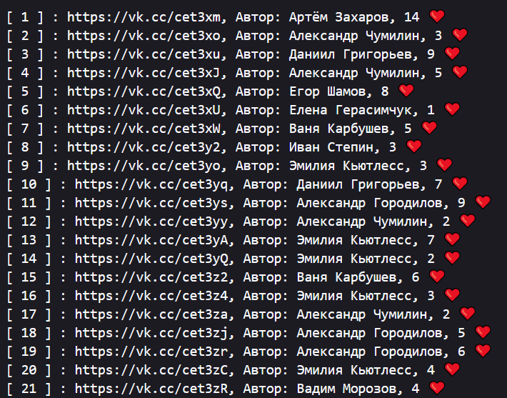
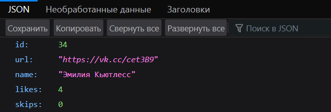
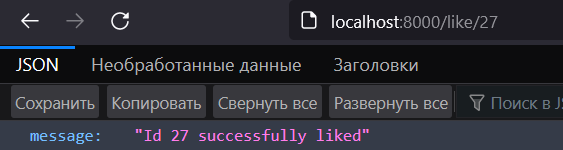
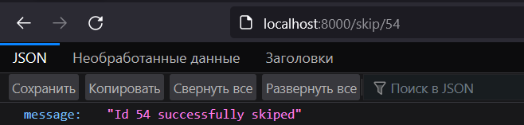
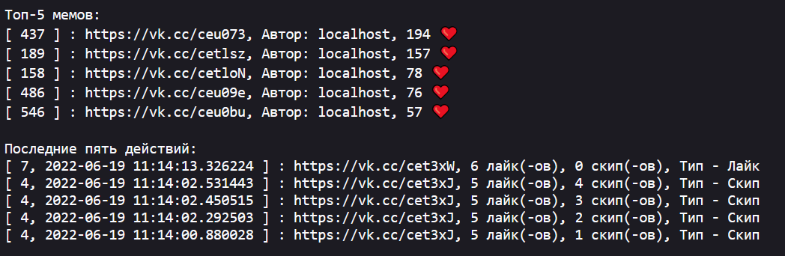
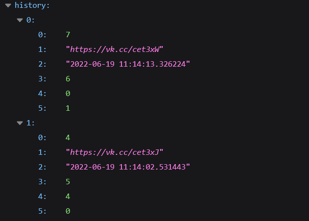
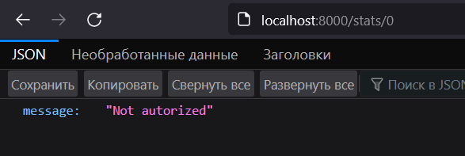
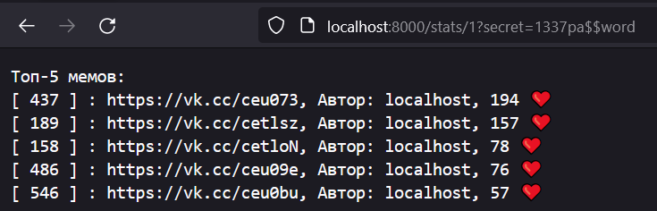

# Vezdekod Backend

---

`Команда: ThereIsNoInfoRoma`

Структура проекта:

- `parse_and_export.py` - Парсер vk.com, экспортирующий данные в бд sqlite3
- `data.db` - база данных sqlite3
- `main.py` - API на FastAPI Framework

Запуск локального веб сервиса:

```shell
$ pip install -r requirements.txt
$ uvicorn main:app
```

---

## Task 10

- Делаем Get запрос на эндпоинт `/task10`:
- Получаем красиво представленные данные:



---

## Task 20

- Чтобы получить рандомный мем, надо сделать Get запрос
на эндпоинт `/` (сразу сделал рандом, т.к он нужен в задание на 30)



- Также мы можем получить мем по id. Для этого передаем id в get параметрах, к примеру `localhost:8000/?id=34`
- Чтобы лайкнуть мем, надо сделать Get запрос на эндпоинт `/like/{meme_id}`



- Чтобы скипнуть мем, надо сделать Get запрос на эндпоинт `/skip/{meme_id}`



- Если id нет в базе данных:


---

## Task 30

```py
params = {"id": 27, "score": 0.65}
meme_id = await get_random_id(params)
```

- Мемы выдаются рандомно, однако указан приоритет таска c id 27.

---

## Task 40

- Добавлены мемы из сообщества [localhost](https://vk.com/it_joke) (500 штук)

---

## Task 50

- Чтобы получить дашборд, надо сделать Get запрос на эндпоинт `/stats/{pretty}`. Если `pretty == 1`, то на выходе мы получим красивый текст:



Если `pretty == 0`, то нам вернутся данные json-ом:



- Однако доступ к дашборду имеют не все. Если мы попробуем запрасить статистику без авторизации, то получим:



Нам надо передать ключ авторизации в Get параметре `secret`. Ключ безопасности `1337pa$$word`. Запрос сделанный с ключом:


